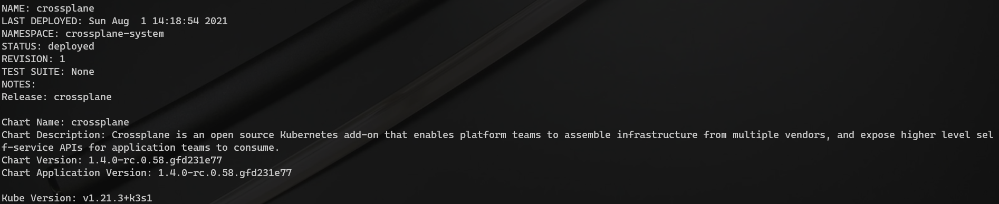

# Crossplane dapr

## Goal

TODO: add goals

## Prerequisites

- kubernetes cluster (v 1.15+)
- helm


## Crossplane

### Install crossplane with helm

We will install latest stable version of *Crossplane*

```bash

# Add helm repo with latest crossplane stable build
helm repo add crossplane-master https://charts.crossplane.io/master/

# Capture repo and version to use them in install command
CP_REPO=$(helm search repo crossplane --devel | awk '{print $1}' | sed -n '2p')
CP_VERSION=$(helm search repo crossplane --devel | awk '{print $2}' | sed -n '2p')

# Install crossplane on active cluster and crete namespace if missing
helm install crossplane $CP_REPO --namespace crossplane-system --create-namespace --version $CP_VERSION --devel
```



### Install crossplane CLI

`curl -sL https://raw.githubusercontent.com/crossplane/crossplane/release-0.13/install.sh | sh`

### Install Azure provider

`kubectl crossplane install provider crossplane/provider-azure:v0.12.0`